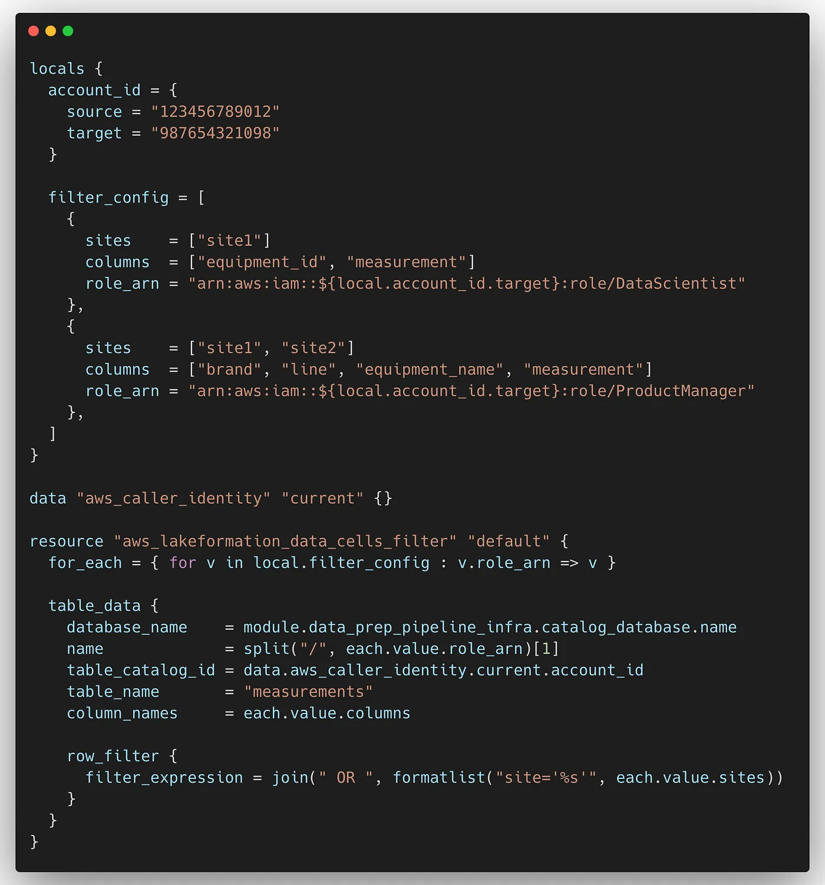
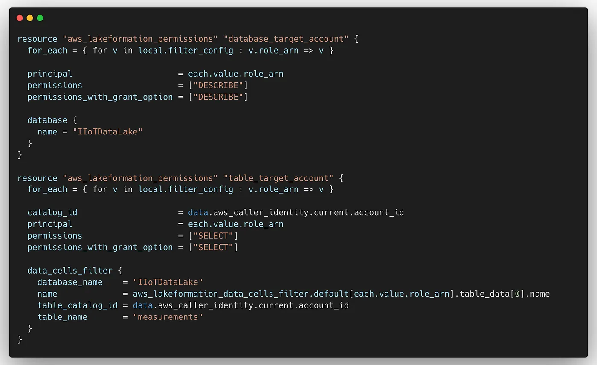
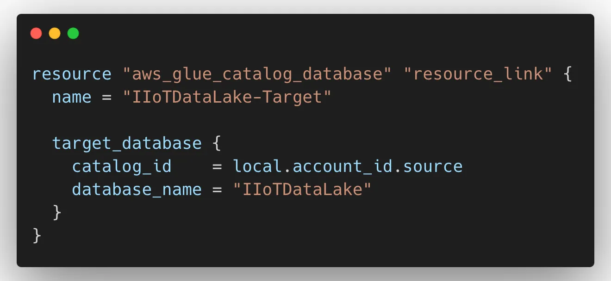
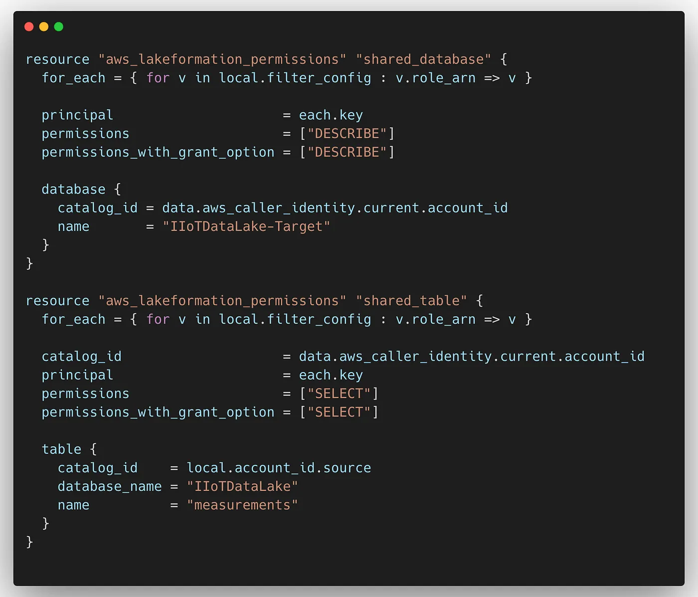

# Introduction

In my [previous blog](), we explored enabling cross-account data sharing using AWS Lake Formation with Terraform. In this post, we’ll dive deeper into enhancing that setup with data filters. Lake Formation data filtering allows for column-level, row-level, and cell-level security. This blog will focus specifically on implementing cell-level security to fine-tune data access controls.

# Table of contents

# Data filter levels

- ## Column-level

Granting permissions on a Data Catalog table with column-level filtering allows users to view only specific columns and nested columns they have access to. This enables defining security policies that grant access to partial sub-structures of nested columns.

- ## Row-level

Granting permissions on a Data Catalog table with row-level filtering allows users to view only specific rows of data they have access to. Filtering is based on the values of one or more columns, and nested column structures can be included in row-filter expressions.

- ## Cell-level

Cell-level security combines both row and column filtering, providing a highly flexible permissions model.

# Creating a Data Filter in the Source Account

Assuming you have already followed the Lake Formation setup in Source Account as detailed in my [previous blog](), we can now proceed with creating the data filter. Let’s use an example involving IIoT measurements. Suppose you have equipment spread across multiple sites and need to grant specific IAM roles access to particular sites and columns. Here’s how to achieve this using Terraform:

In this example:

1. **Define Local Configuration:** The filter_config variable lists the sites, columns, and IAM roles in the target account that need access.

2. **Retrieve AWS Account ID:** The aws_caller_identity data source fetches the current AWS account ID.

3. **Create Data Cell Filters:** The aws_lakeformation_data_cells_filter resource iterates over the filter_config to create the necessary filters for each IAM role.

This setup ensures that specific IAM roles have access only to the defined sites and columns, enhancing security and data management.

# Share Catalog with Target Account

Now that we’ve created the data filter, let’s utilize it while sharing the catalog. In the code snippet below, we’ll share the database and table with the target account. Note that when sharing the table, we’ll include the data filter created in the previous step.

In this snippet:

1. **Share Database Permissions:** The aws_lakeformation_permissions resource shares the IIoTDataLake database with the target account and grants the DESCRIBE permission.

2. **Share Table Permissions:** Similarly, the resource shares the measurements table with the target account, granting the SELECT permission. It also includes the data filter created earlier, ensuring that the target account only accesses the filtered data according to the defined criteria.

With this setup, you can securely share specific data from your catalog with the target account, ensuring compliance and data integrity.

# Creating Resource Link in Target Account for Access

After sharing the catalog and table with a data filter to the target account, let’s proceed to the target account to establish a resource link for accessing the shared catalog data.

In this setup:

1. **Create Resource Link:** The aws_glue_catalog_database resource establishes a database resource link named IIoTDataLake-Target in the target account. It links to the IIoTDataLake database in the source account, enabling access to the shared catalog data.

By creating this resource link, you enable seamless access to the shared data catalog from the target account, facilitating data utilization and analysis across accounts while maintaining security and compliance measures.

# Granting Permissions for IAM Roles

Now that we’ve created the resource link, we can grant access to the resource link and the shared catalog. After this step, the IAM roles will have access to the filtered data shared from the source account.

In this configuration:

1. **Grant Database Permissions:** The aws_lakeformation_permissions resource grants the DESCRIBE permission to the IAM roles for the IIoTDataLake-Target database in the target account. This allows the roles to describe the database structure and metadata.

2. **Grant Table Permissions:** Similarly, the resource grants the SELECT permission to the IAM roles for the measurements table in the shared catalog. This enables the roles to select and read data from the table.

With these permissions granted, the IAM roles now have access to the filtered data shared from the source account, allowing for seamless data analysis and utilization within the target account.

# Conclusion

In this blog, we’ve delved into the intricacies of cross-account data sharing using AWS Lake Formation and Terraform. By implementing data filters and establishing resource links, we’ve ensured secure access to shared data while maintaining granular control over permissions. This streamlined approach facilitates collaborative data analysis across accounts, empowering teams to derive insights effectively while upholding data security and compliance standards.

# References

[https://docs.aws.amazon.com/lake-formation/latest/dg/data-filtering.html](https://docs.aws.amazon.com/lake-formation/latest/dg/data-filtering.html)
