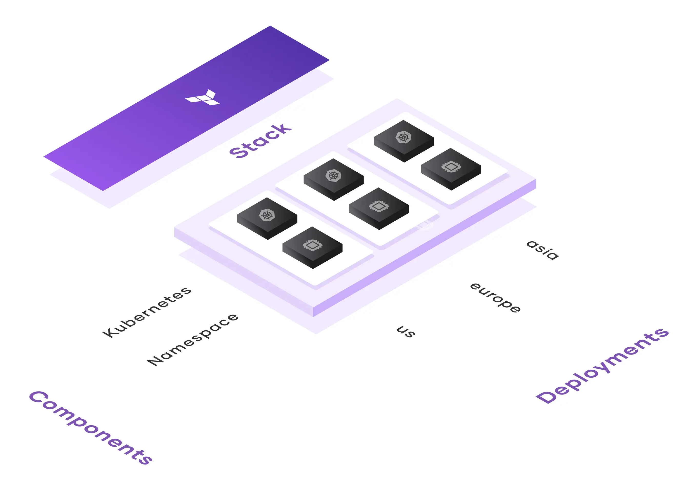
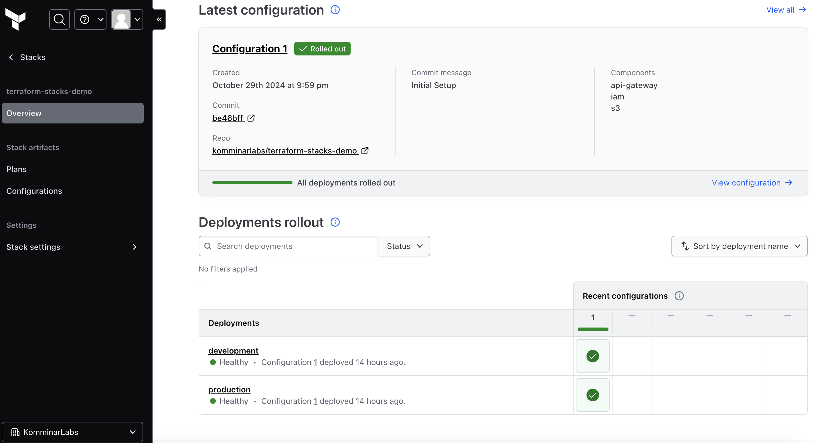
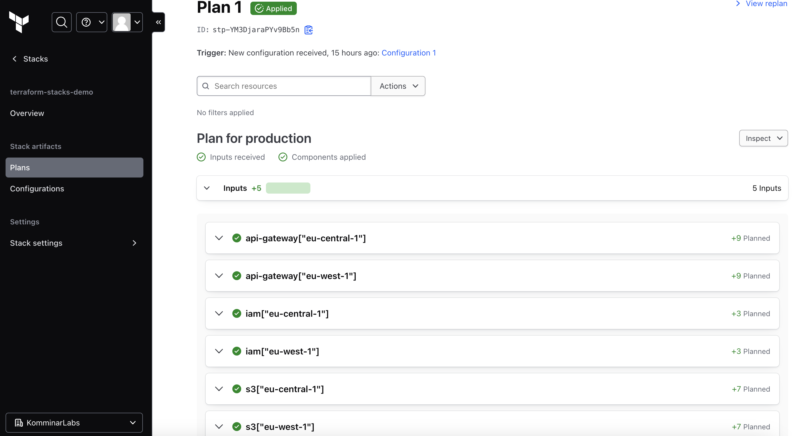

Ever since the private preview of Terraform Stacks, I’ve been eager to dive in and explore this new approach to provisioning infrastructure. After a year in private preview, the public beta was finally announced at HashiConf 2024, and I’m excited to share my experience!

In this blog, I’ll walk you through the essentials of Terraform Stacks configurations and demonstrate how to deploy a REST API as an S3 proxy using API Gateway.



## Table of contents

# What is a Stack?

Terraform excels at planning and applying changes to individual resources, but it has historically lacked a built-in solution for consistently deploying identical infrastructure across multiple environments or cloud regions. To work around this, many of us developed our own methods. Personally, I’ve used workspaces for environment-specific configurations and duplicated code with different providers for multi-region setups. However, this approach sacrifices the DRY (Don't Repeat Yourself) principle and requires stitching together dependencies manually, complicating state management and orchestration.

Terraform Stacks are designed to streamline the coordination, deployment, and lifecycle management of complex, interdependent configurations. With Stacks, we can easily replicate infrastructure across environments and regions, set orchestration rules, and automate the propagation of changes, drastically reducing time and operational overhead.

In essence, Stacks address the "bigger picture" of infrastructure provisioning, offering a scalable solution to manage consistent, repeatable deployments across environments and regions.

# Stack configuration

Stacks use their own domain-specific language (DSL), also based on HCL (HashiCorp Configuration Language).

## `component`

Components are the building blocks of Stack configurations, defined in files with the `.tfstack.hcl` extension. Each component represents a group of interrelated resources, such as the frontend, backend, and database of an application, that are typically deployed together. Though similar to modules, components differ in that they are deployed as a single unit. This means that each component is always planned or applied in its entirety before moving on to other dependent components. In contrast, modules in traditional Terraform treat all resources within modules as part of a single, unified state and dependency graph, regardless of module structure.

Below is an example of a component block, where you specify the source module, inputs, and providers for each component. Component blocks also support the `for_each` meta-argument, enabling you to provision modules across multiple AWS regions within the same environment.

A key difference between components and modules is in how provider configurations are handled, which we’ll dive into in the next section.

```hcl
component "api-gateway" {
  for_each = var.regions
  source   = "./api-gateway"

  providers = {
    aws = provider.aws.configurations[each.value]
  }

  inputs = {
    name         = var.name
    iam_role_arn = component.iam[each.value].arn
    region       = each.key
    tags         = var.tags
  }
}
```

## `required_providers` and `provider`

The `required_providers` block functions just as it does in traditional Terraform configurations. However, the `provider` block has some key differences. It supports the `for_each` meta-argument, allows aliases to be defined in the block header, and requires that arguments be passed through a `config` block. Like other Stack configurations, it is also defined in files with the `.tfstack.hcl` extension.

```hcl
required_providers {
  aws = {
    source  = "hashicorp/aws"
    version = "~> 5.7.0"
  }
}

provider "aws" "configurations" {
  for_each = var.regions

  config {
    region = each.value

    assume_role_with_web_identity {
      role_arn           = var.role_arn
      web_identity_token = var.identity_token
    }
  }
}
```

In the provider configuration above, `for_each` is used to dynamically create multiple AWS configurations. However, this approach poses a challenge when decommissioning resources in a specific region. You can’t simply remove the region from the variable, as Terraform still requires the component’s providers to successfully delete the component’s resources.

To address this, you can use the `removed` block to gracefully decommission components, ensuring proper removal without causing configuration errors.

```hcl
removed {
  from   = component.per_region[var.region]
  source = "./api-gateway"

  providers = {
    aws = provider.aws.configurations[var.region]
  }
}
```

> ### Provider lock file
>
> A Stack cannot run without a lock file for its providers. After defining your providers, use the Terraform Stacks CLI to generate a `.terraform.lock.hcl` lock file. The tfstacks providers lock command(`tfstacks providers lock`) creates and updates your `.terraform.lock.hcl` file.

## `deployment`

The deployment configuration file specifies how many instances of the Stack Terraform should deploy. Each Stack must include at least one `deployment` block. These configuration files are located at the root level of your repository and use the `.tfdeploy.hcl` file extension.

Within the `deployment` block, you can define a map of inputs to provide any unique configurations required for each deployment. Note that the `deployment` block does not accept meta-arguments.

```hcl
deployment "development" {
  inputs = {
    name           = "dev-${local.name}"
    identity_token = identity_token.aws.jwt
    regions        = ["eu-central-1"]
    role_arn       = store.varset.oidc_role_arn.dev

    tags = {
      Environment = "development"
      Stack       = local.stack
      Project     = local.project
    }
  }
}
```

## `orchestrate`

The `orchestrate` block allows you to define rules for managing deployment plans within your deployment configuration file (`.tfdeploy.hcl`). Each `orchestrate` block contains one or more `check` blocks, which specify conditions that must be met for the orchestration rule to take effect. All conditions within the `check` blocks must pass for the `orchestrate` rule to be applied.

### Orchestrate rule types

You can choose from two types of orchestration rules:

1. **`auto_approve`**: This rule runs after a Stack generates a plan and automatically approves the plan if all checks pass.
2. **`replan`**: This rule runs after a Stack applies a plan, automatically triggering a replan if all checks pass.

By default, each Stack has an `auto_approve` rule named `empty_plan`, which automatically approves a plan if it contains no changes.

```hcl
orchestrate "auto_approve" "prd_no_modifications_or_destructions" {
  check {
    condition = context.plan.changes.change == 0
    reason    = "Plan is modifying ${context.plan.changes.change} resources."
  }

  check {
    condition = context.plan.changes.remove == 0
    reason    = "Plan is destroying ${context.plan.changes.remove} resources."
  }

  check {
    condition = context.plan.deployment == deployment.production
    reason    = "Plan is not production."
  }
}
```

The above blocks automatically approve the production deployment if no resource modifications or deletions are detected.

# Stack authentication

You can authenticate a Stack in two ways: by using OIDC (recommended) or by utilizing AWS credentials through the `store` block.

## OIDC

[OpenID Connect (OIDC)](https://openid.net/developers/how-connect-works/) is an identity layer on top of the OAuth 2.0 protocol. You can use HCP Terraform’s Workload identity tokens, built on the OpenID Connect protocol, to securely connect and authenticate your Stacks with cloud providers. Stacks have a built-in `identity_token` block that creates workload identity tokens, also known as JWT tokens. You can use these tokens to authenticate Stacks with Terraform providers securely.

```hcl
identity_token "aws" {
  audience = ["aws.workload.identity"]
}
```

I have an [example](https://github.com/komminarlabs/terraform-stacks-initial-setup) that demonstrates how to set up OIDC in conjunction with Stacks.

## Credentials

You can use the `store` block to define key-value secrets in your deployment configuration and then access those values in your deployments. You can use the store block to access credentials stored in an Terraform variable set.

```hcl
store "varset" "aws_keys" {
  id       = "varset-<variables-set-id>"
  category = "env"
}

deployment "development" {
  inputs = {
    access_key    = store.varset.aws_keys.AWS_ACCESS_KEY_ID
    secret_key    = store.varset.aws_keys.AWS_SECRET_ACCESS_KEY
    session_token = store.varset.aws_keys.AWS_SESSION_TOKEN
  }
}
```

# Demo

To demonstrate Terraform Stacks, we'll create a REST API in API Gateway that acts as an S3 proxy, enabling users to view or download objects from an S3 bucket. To set this up, we’ll need the following:

1. An **IAM Role** to grant API Gateway access to S3.
2. **API Gateway resources** configured to expose S3 operations.
3. An **S3 bucket** to store the objects.

For this demo, we'll create three separate components for each of these resource groups. Now, let’s dive into the Stack configuration. The complete setup can be found in the [terraform-stacks-demo](https://github.com/komminarlabs/terraform-stacks-demo) repository.

## `*.tfstack.hcl`

The Stack is divided into three configuration files:

1. ### `providers.tfstack.hcl`

Configures the providers for multi-region deployment using the `for_each` meta-argument to manage multiple regions efficiently.

2. ### `variables.tfstack.hcl`

Defines the input variables used across the Stack.

3. ## `components.tfstack.hcl`

Initializes the three main components, using local modules as the source for each.

## `deployments.tfdeploy.hcl`

I've defined a `store` block to retrieve the `role_arn` created in the [terraform-stacks-initial-setup](https://github.com/komminarlabs/terraform-stacks-initial-setup) repository.

```hcl
store "varset" "oidc_role_arn" {
  id       = "varset-vre8k5fyfNFogyDn"
  category = "terraform"
}
```

### Development

For development purposes, I want this Stack to be deployed exclusively in the `eu-central-1` region.

```hcl
deployment "development" {
  inputs = {
    name           = "dev-${local.name}"
    identity_token = identity_token.aws.jwt
    regions        = ["eu-central-1"]
    role_arn       = store.varset.oidc_role_arn.dev

    tags = {
      Environment = "development"
      Stack       = local.stack
      Project     = local.project
    }
  }
}
```

### Production

For production, I’ve enabled multi-region deployment by adding `eu-west-1` to the regions variable.

```hcl
deployment "production" {
  inputs = {
    name           = "prd-${local.name}"
    identity_token = identity_token.aws.jwt
    regions        = ["eu-central-1", "eu-west-1"]
    role_arn       = store.varset.oidc_role_arn.prd

    tags = {
      Environment = "production"
      Stack       = local.stack
      Project     = local.project
    }
  }
}
```

### Orchestration

I've added three `orchestrate` blocks with the following configurations:

1. Automatically approve deployments in non-production environments.
2. Automatically approve production deployments if there are no resource modifications or deletions.
3. Replan production deployment once if it fails.

```hcl
orchestrate "auto_approve" "non_prd" {
  check {
    condition = context.plan.deployment != deployment.production
    reason    = "Plan is production."
  }
}

orchestrate "auto_approve" "prd_no_modifications_or_destructions" {
  check {
    condition = context.plan.changes.change == 0
    reason    = "Plan is modifying ${context.plan.changes.change} resources."
  }

  check {
    condition = context.plan.changes.remove == 0
    reason    = "Plan is destroying ${context.plan.changes.remove} resources."
  }

  check {
    condition = context.plan.deployment == deployment.production
    reason    = "Plan is not production."
  }
}

orchestrate "replan" "prod_for_errors" {
  check {
    condition = context.plan.deployment == deployment.production
    reason    = "Only automatically replan production deployments."
  }

  check {
    condition = context.plan.applyable == false
    reason    = "Only automatically replan plans that were not applyable."
  }

  check {
    condition = context.plan.replans < 2
    reason    = "Only automatically replan failed plans once."
  }
}
```

## How does it look in the UI?

A new configuration is created every time code is merged into `main` branch, and a new plan to apply those code changes is created for each of your deployments.





# Thoughts

Terraform Stacks feel like a feature that should have been available from the start, but it's great to know they'll be available in the future. During my trial period, I found myself wishing for a feature that would enable automatic approval of production deployments once non-production deployments succeed. While it’s unclear if this feature will be added, it would certainly be a valuable addition.
