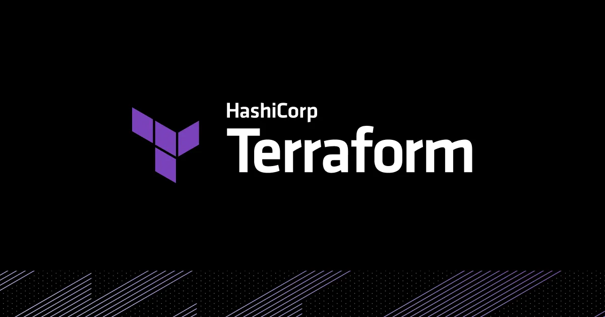
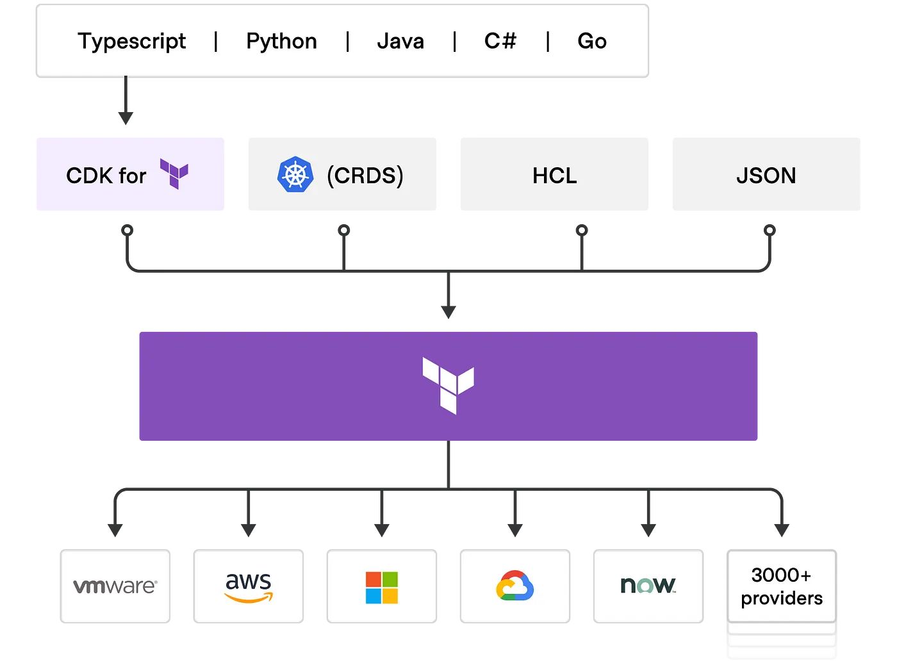

# Introduction

In this blog I will explain what is Terraform and some of its common terms. I will also list some good to follow standards when you start using Terraform.



# Table of contents

# What is it?

- Terraform is an infrastructure as code tool that lets you define both cloud and on-premise resources in human-readable configuration files.
- It can manage both low-level(Networking, Storage) & high-level components(DNS, SaaS).
- It can be used to manage single application and also an entire datacenter.

# What it isn’t?

It is not a configuration management tool that focuses on single application configuration but Terraform focuses on higher-level abstraction like managing the entire environment.

# Terraform Editions

## Open Source

A free to download tool that you interact with CLI.

## Terraform Cloud

- SaaS application that runs in a secure remote environment and stores states and secrets.
- Connects to VCS and new commits triggers Terraform automatically.
- It has Rich UI and RBAC controls.

## Terraform Enterprise

Self-hosted distribution of Terraform Cloud. It offers enterprises a private instance of the Terraform Cloud application, with no resource limits and with additional enterprise-grade architectural features like audit logging and SAML single sign-on.

# Terraform Jargons

## Workspace

- A workspace contains everything that Terraform needs to manage a given collection of infrastructure.
- It links to VCS and has Variables, Credentials, Secrets, State versions, and Run History.

## Backend

A backend defines where Terraform stores its state data files.

```hcl
terraform {
  cloud {
    organization = "sampleorg"

    workspaces {
      name = "dev-workspace"
    }
  }
}
```

## Provider

- Provides abstraction to APIs that connect to the infrastructure hosts.
- Without providers, Terraform can’t manage any kind of infrastructure.
- Every provider makes a list of resources and data types available for use in the Terraform code.

## Registry

The Terraform Registry is an interactive resource for discovering a wide selection of integrations (providers), configuration packages (modules), and security rules (policies) for use with Terraform.

## HCL

HCL(HashiCorp Configuration Language) is a declarative and domain-specific language.

## State

- Terraform is a stateful application, meaning it keeps track of everything it builds in the infrastructure.
- State is used by Terraform to map real-world resources to your configuration.

# How Terraform works?

- Terraform creates and manages resources on cloud platforms and other services through their APIs.
- Providers enable Terraform to work with virtually any platform or service with an accessible API.
- The core Terraform workflow consists of three stages:

## Write:

Defining resources

## Plan:

An execution plan that describes the infra terraform will create/update/destroy based on existing infra and your configurations.

## Apply:

Performing the operations in the correct order by respecting resource dependencies. Can be automatic or manual.

# Configuration Language

Terraform supports HCL, JSON, CRDS and CDK. CDK allows you to use familiar programming languages to define and provision infrastructure. It also lets you leverage the power of your existing toolchain for testing, dependency management, etc. In this blog we will focus on HCL and how to configure Providers, Resources and Modules.



## HCL

### Provider

Terraform Cloud and Terraform Enterprise install providers as part of every run.

#### Provider configuration

Provider configurations belong in the root module of a Terraform configuration. Child modules receive their provider configurations from the root module.

```hcl
provider "aws" {
  alias  = "us_east_1"
  region = "us-east-1"
}
```

#### Provider Requirements

Each Terraform module must declare which providers it requires, so that Terraform can install and use them.

```hcl
terraform {
  required_providers {
    mycloud = {
      source  = "mycorp/mycloud"
      version = "~> 1.0"
    }
  }
}
```

### Variables, Outputs, and Locals

In comparison with traditional programming languages,

- Input variables are like function arguments.
- Output values are like function return values.
- Local values are like a function’s temporary local variables.

```hcl
variable "image_id" {
  type = string
}

output "instance_ip_addr" {
  value = aws_instance.server.private_ip
}

locals {
  common_tags = {
    Stack       = local.stack
    Environment = local.environment
  }
}
```

### Resource

Each resource block describes one or more infrastructure objects, such as virtual networks, compute instances, or higher-level components such as DNS records.

```hcl
resource "aws_athena_workgroup" "default" {
  name = "default"
  tags = locals.common_tags

  configuration {
    enforce_workgroup_configuration    = true
    publish_cloudwatch_metrics_enabled = true

    result_configuration {
      output_location = "s3://some-bucket/path"

      encryption_configuration {
        encryption_option = "SSE_S3"
      }
    }
  }
}
```

### Data Sources

Data sources allow Terraform to use information defined outside of Terraform.

```hcl
data "aws_vpc" "default" {
  id = "vpc-0aexzk638sp5h9u7v"
}
```

### Modules

Containers for multiple resources that are used together.

#### Root Module

Every Terraform configuration has at least one module, known as its root module, which consists of the resources defined in the .tf files in the main working directory.

#### Child Modules

A module that has been called by another module is often referred to as a child module.

#### Published Modules

In addition to modules from the local filesystem, Terraform can load modules from a public or private registry. You can find some of my AWS Terraform modules [here](https://github.com/orgs/komminarlabs/repositories?q=terraform-aws-).

```hcl
module "example_glue_job" {
  source            = "github.com/komminarlabs/terraform-aws-glue-job?ref=v0.1.0"
  name              = "example-glue-job"
  max_retries       = 1
  number_of_workers = 2
  schedule          = "cron(0 12 * * ? *)"
  script_location   = "S3://example-bucket/location/script.py"
  trigger_type      = "SCHEDULED"
  worker_type       = "Standard"

  default_arguments = {
    "--VAR1" = "some value"
  }

  tags = {
    Environment = "development"
    Stack       = "glue"
  }
}
```

## Standards

- Use `count` only for enabling/disabling resource creation and use for_each for loops.
- Variables are ordered A-Z, but tags always comes at last.
- Multi-line list or map should be in new line.

```hcl
resource "aws_sagemaker_domain" "default" {
  domain_name             = var.name
  app_network_access_type = var.app_network_access_type
  auth_mode               = "IAM"
  subnet_ids              = var.subnet_ids
  vpc_id                  = var.vpc_id
  tags                    = var.tags

  default_user_settings {
    execution_role  = var.role_arn != null ? var.role_arn : aws_iam_role.default[0].arn
    security_groups = var.security_groups

    jupyter_server_app_settings {
      lifecycle_config_arns = [aws_sagemaker_studio_lifecycle_config.jupyter.arn]

      default_resource_spec {
        instance_type        = "system"
        lifecycle_config_arn = aws_sagemaker_studio_lifecycle_config.jupyter.arn
      }
    }

    kernel_gateway_app_settings {
      lifecycle_config_arns = [aws_sagemaker_studio_lifecycle_config.kernel.arn]

      default_resource_spec {
        instance_type        = "system"
        lifecycle_config_arn = aws_sagemaker_studio_lifecycle_config.kernel.arn
      }
    }
  }
}
```

- There are some linters already available for you to use
  - [https://github.com/terraform-linters/tflint](https://github.com/terraform-linters/tflint)
  - [https://github.com/terraform-linters/tflint-ruleset-terraform](https://github.com/terraform-linters/tflint-ruleset-terraform)
  - [https://github.com/terraform-linters/tflint-ruleset-aws](https://github.com/terraform-linters/tflint-ruleset-aws)
